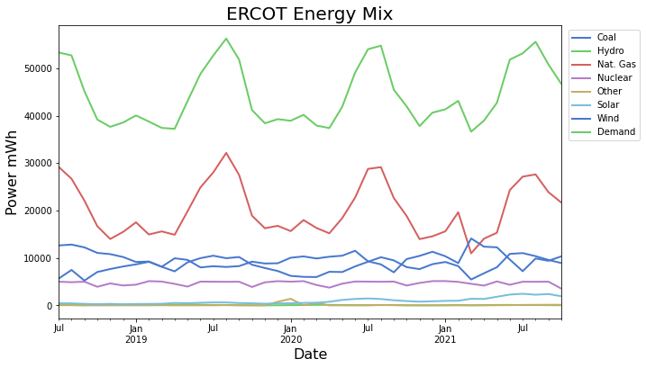
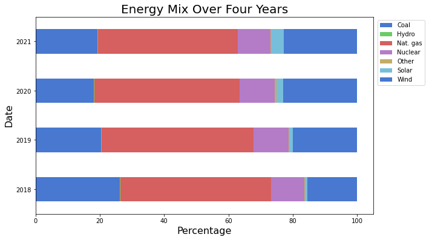
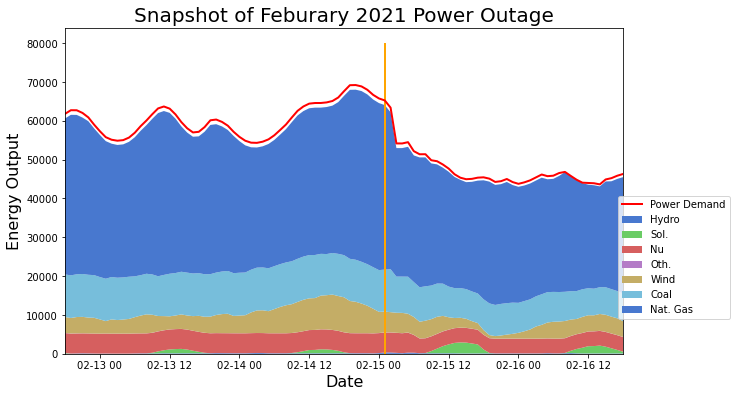

# Wind Energy Analysis and Prediction
---
### Problem Statement

I am an analyst at General Analytics, a consulting company which expertise is in forecasting. Our audience is the forecasting department at (Electric Reliability Council of Texas) or ERCOT, the Texas power regulator. We want to sell them an application that predicts hourly wind power output for the next month. In this project, we will attempt to create a model to predict the hourly wind power output for the ERCOT power grid for a month's time span. Our baseline will be the mean of the power output over a month timespan, and we will see if we can create a model that will outperform that baseline. Our evaluation metrics will be Mean Squared Error, and Root Mean squared Error.

### Background

A combination of seven power sources supply the Texas power grid, these include Gas, Hydro-Electric, Nuclear, Solar, Wind, Coal, and Other sources. The top three sources are Natural Gas, Wind, and Coal. Historically coal has been the main power generator for American power grids, however, due to climate change policies, American electric power generation is switching to carbon-free renewable energy sources. In America's path to zero carbon emissions, Natural gas, which has a less carbon footprint than coal, has become the reliable transition fuel for America's power generation. In the ERCOT power grid, the two main renewable resources are wind and solar. These two sources do not provide power as consistently as natural gas, solar power output is reduced when it is cloudy and zero at night, wind turbines won't generate power when the wind is not blowing. When these renewable power sources are reduced due to weather or sunlight, Natural Gas power plants increase their power output to meet the demand of the power grid. With a model that can predict wind power output a month into the future, ERCOT can better plan how much natural gas power to feed into the system.

### Description of data

#### Data Included for Analysis
* [`texas_power_gen.csv`](../Data/texas_power_gen.csv): EIA Power Generation Data for ERCOT.
* [`U.S. Energy Information Administration (EIA) - ERCOT Power Data`](https://www.eia.gov/electricity/gridmonitor/dashboard/electric_overview/balancing_authority/ERCO): EIA website for ERCOT Grid.

#### Data Dictionary

|Feature|Type|Dataset|Description|
|---|---|---|---|
|**Datime**|*datetime64*|`texas_power_gen.csv`| Datetime index of dataframe (Hourly). |
|**coal_mwh**|*int64*|`texas_power_gen.csv`| ERCOT Hourly power generation from Coal Plants |
|**hydro_mwh**|*int64*|`texas_power_gen.csv`| ERCOT Hourly power generation from Hydo-Electric Plants |
|**nuclear_mwh**|*int64*|`texas_power_gen.csv`| ERCOT Hourly power generation from Nuclear Plants |
|**other_sources_mwh**|*int64*|`texas_power_gen.csv`| ERCOT Hourly power generation from Other Sources |
|**solar_sources_mwh**|*int64*|`texas_power_gen.csv`| ERCOT Hourly power generation from Solar Generation |
|**wind_sources_mwh**|*int64*|`texas_power_gen.csv`| ERCOT Hourly power generation from Wind Plants |
|**demand_mwh**|*int64*|`texas_power_gen.csv`| ERCOT Hourly power demand |

#### Data Included Streamlit application
* [`EIA API for Texas`](https://www.eia.gov/opendata/qb.php?category=3390202&sdid=EBA.TEX-ALL.TI.HL): EIA API to update Streamlit app.

### Exploratory Data Analysis

The Above Figure shows the Energy mix of the ERCOT power grid for the last three years.

Energy portfolio of ERCOT over the last four years showing a reduction of fossil fuel usage, and an increase of renewable power options.

An example of the 2021 winter storm, A time when the power grid could not supply the necessary power due to a natural gas shortfall.

### Model Selection and Performance

With four years of hourly wind data provided by the US Energy Information Administration. I created four models to forecast the next month of wind power generation. These models included: An ARIMA model which I chose the p, d, q, an Auto-ARIMA model, FB Prophet, FB Prophet with parameters. Results are show below.

| Model | #1 ARIMA | #2 Auto-ARIMA| #3 Prophet (baseline)| #4 Prophet (Seasonality)|
|:-----:| :-----:| :-----: | :-----:| :-----: |
| Baseline RMSE mWh | 6620 | 6620 | 6504 | 6504 |
| MSE mWh| 125 E6 | 143 E6 | 37 E6 | 34 E6 |
| RMSE mWh| 11k | 12k | 6.1k | 5.9k |

### Conclusions and Recommendations

Returning to our problem statement can we build a model to accurately forecast the wind-power output for the ERCOT grid better than our null model of the mean. The answer is yes using our final prophet model, which included yearly and daily seasonality. Predicting better than the mean of our test data is not a huge feat our model RMSE was 5902 MWH which is about 25% - 33% of our 95% confidence interval; however, we did learn that with this data Facebook Prophet performed better than our 2 SARIMA models. If this model were to be implemented we would use it more for inference using the 95% confidence interval, we could state that we are 95% "confident", that the wind power output is in that interval.

Predicting wind power output is synonymous with predicting the weather.  Time series models predict the overall trend of the data, and they attempt to model in seasonal shocks to the trend of the data. In our case, the shocks to the system are the movements of high and low-pressure systems.

In a future iteration of this model, I want to look into hyper-parameter tuning using cross-validation of the prophet model. I didn't look into tuning the "changepoint_prior_scale", and "seasonality_prior_scale", which determines the flexibility of the trend, and in particular how much the trend changes at changepoints either seasonally, or in one season.  I also want to look into how the predictions are affected by changing the sample rate and seeing if the model forecasts daily or weekly data better than hourly.  

### References

* [`EIA Website - data provider`](https://www.eia.gov/electricity/gridmonitor/expanded-view/custom/pending/GenerationByEnergySource-14/edit)
* [`German Wind Power Generation EDA+Forecasting`](https://www.kaggle.com/ggopinathan/german-wind-power-generation-eda-forecasting#Time-Series-Modeling)
* [`machinelearningplus.com`](https://www.machinelearningplus.com/time-series/arima-model-time-series-forecasting-python/)
* [`Facebook Prophet Quick Start`](https://facebook.github.io/prophet/docs/quick_start.html#python-api)
* [`Deploying A FB Prophet model by: Edward Krueger`](https://towardsdatascience.com/deploying-a-prophet-forecasting-model-with-streamlit-to-heroku-caf1729bd917)
* [`Chicago Python Users Group: tour of FB Prophet`](https://www.youtube.com/watch?v=95-HMzxsghY)
